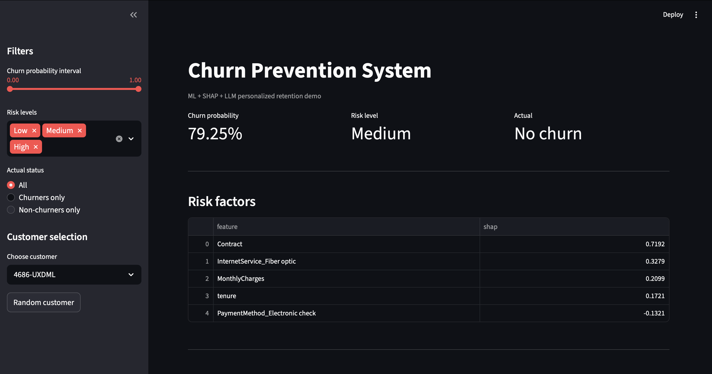
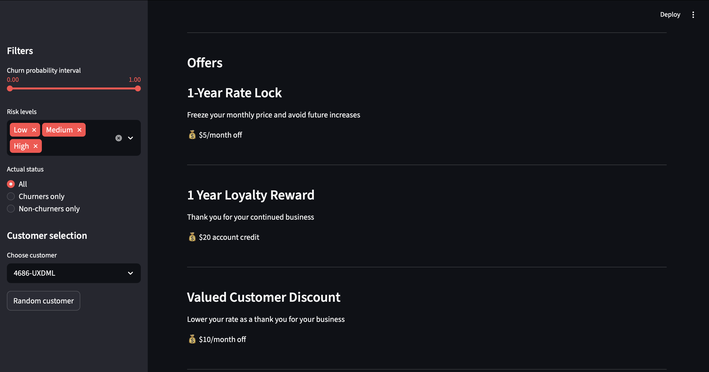
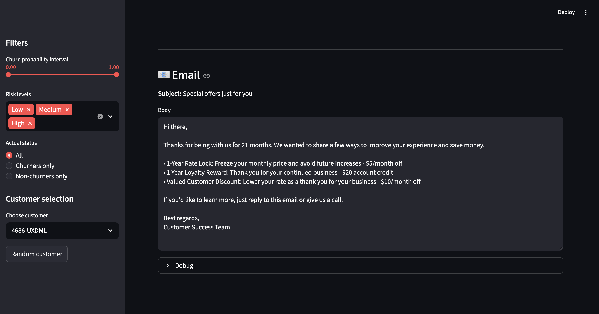

# Agentic Churn Prevention

> **An end-to-end AI system for customer retention combining Machine Learning, Explainable AI (SHAP), profit-driven decision optimization, and Large Language Models.**


---

## Overview

Customer churn is one of the most expensive problems for subscription-based businesses. While most churn prediction systems stop after identifying customers at risk, this project goes several steps further by automatically deciding **who should be contacted**, **which retention offer should be proposed**, and **how the message should be personalized**.

This repository contains the complete implementation of my MSc dissertation:

> **Agentic AI System for Churn Prevention: ML and LLM Models for Automated Retention Actions**

**MSc in Data Science & Artificial Intelligence**  
**emlyon business school**

---

# System Architecture

```text
IBM Telco Customer Dataset
            │
            ▼
Data Preprocessing
            │
            ▼
Feature Engineering
            │
            ▼
ML Model Benchmark
(LogReg • RF • XGBoost • CatBoost • LightGBM)
            │
            ▼
Bayesian Hyperparameter Optimization (Optuna)
            │
            ▼
Best Model (LightGBM)
            │
            ▼
Profit-driven Threshold Optimization
            │
            ▼
SHAP Explanations
            │
            ▼
Personalized Offer Selection
            │
            ▼
Gemini LLM
            │
            ▼
Personalized Retention Email
```

---

# Key Features

- End-to-end churn prediction pipeline
- Five machine learning models benchmarked
- Bayesian hyperparameter optimization with Optuna
- Profit-driven customer targeting instead of default classification thresholds
- SHAP explainability for customer-level decision making
- Automatic personalized retention offer selection
- Gemini-powered personalized retention emails
- Interactive Streamlit web application
- Fully reproducible pipeline

---

# Business Results

The complete system was evaluated on a **held-out test set of 1,409 customers**.

| Strategy | Profit | Improvement | Customers Contacted |
|-----------|---------:|------------:|-------------------:|
| Mass campaign | **\$10,598** | — | 100% |
| ML Targeting | **\$15,509** | **+46.3%** | **55.9%** |
| ML + LLM Agent | **\$17,467** | **+64.8%** | **55.9%** |

## Highlights

- **46.3%** higher profit than traditional mass marketing
- **64.8%** higher profit after adding LLM personalization
- 🎯 Only **55.9%** of customers need to be contacted
- Personalized emails increase estimated offer acceptance from **18% to 22%**

---

# Machine Learning Pipeline

The project follows a complete production-style workflow.

## 1. Data preprocessing

- Missing value handling
- Feature engineering
- Categorical encoding
- Train / Validation / Test split
- Class imbalance handling

---

## 2. Model benchmark

Five classifiers were evaluated using **5-fold Stratified Cross Validation**.

- Logistic Regression
- Random Forest
- XGBoost
- CatBoost
- LightGBM

Performance metrics:

- AUC-ROC
- Precision
- Recall
- F1-score

---

## 3. Bayesian Optimization

Hyperparameters were optimized using **Optuna**.

- 100 optimization trials per model
- Tree-structured Parzen Estimator (TPE)
- 5-fold cross validation

---

## 4. Final Model

The selected model is **LightGBM**.

Validation performance:

| Metric | Value |
|---------|------:|
| AUC | **0.8415** |
| Recall | **80.7%** |

---

## 5. Profit Optimization

Instead of using the standard **0.5** classification threshold, customer targeting is optimized to maximize expected business profit.

The optimization considers:

- Customer Lifetime Value (LTV)
- Intervention costs
- Acceptance probabilities
- Treatment heterogeneity
- Causal attribution factor

---

## 6. Explainability

For every customer, SHAP is used to determine:

- Why the customer is likely to churn
- Which features contribute most
- Which retention actions are relevant

Only offers corresponding to **positive SHAP contributions** are recommended.

---

## 7. Agentic AI Layer

The AI agent automatically performs:

1. Predict churn probability
2. Assign intervention strategy
3. Explain prediction with SHAP
4. Select personalized offers
5. Generate customer-specific email using Gemini

No manual intervention is required.

---

# Streamlit Application

The repository includes an interactive Streamlit application.

### Features

- Customer selection
- Churn probability prediction
- Customer risk segmentation
- SHAP explanation dashboard
- Personalized retention offers
- AI-generated retention email
- Business profit estimation

## Screenshots

```markdown


The dashboard displays the predicted churn probability, customer risk level, actual churn status, and the top SHAP features driving the prediction.

---

### Personalized Retention Offers



Based on the customer's SHAP explanations, the agent recommends tailored retention offers designed to maximize the likelihood of customer retention while considering business profitability.

---

### AI-Generated Retention Email



Using the selected offers and customer profile, Gemini generates a personalized retention email ready for deployment.
```

---

# Repository Structure

```text
agentic-churn-prevention/
│
├── app/
│   └── app.py
│
├── data/
│   └── IBM Telco Dataset
│
├── models/
│   └── Trained LightGBM model
│
├── notebooks/
│   └── Exploratory Data Analysis
│
├── outputs/
│   ├── figures/
│   ├── metrics/
│   └── reports/
│
├── src/
│   ├── preprocess.py
│   ├── train_models.py
│   ├── tune_hyperparams.py
│   ├── evaluate.py
│   ├── threshold_optimisation.py
│   └── agent.py
│
├── requirements.txt
└── README.md
```

---

# Installation

```bash
git clone https://github.com/abndaw/agentic-churn-prevention.git

cd agentic-churn-prevention

pip install -r requirements.txt
```

---

# Usage

## Train models

```bash
python src/train_models.py
```

## Hyperparameter optimization

```bash
python src/tune_hyperparams.py
```

## Evaluate models

```bash
python src/evaluate.py
```

## Optimize decision thresholds

```bash
python src/threshold_optimisation.py
```

## Launch the Streamlit application

```bash
streamlit run app/app.py
```

---

# Technologies

- Python
- Pandas
- NumPy
- Scikit-learn
- LightGBM
- XGBoost
- CatBoost
- Optuna
- SHAP
- Google Gemini API
- Streamlit
- Matplotlib
- Plotly

---

# Dataset

The project uses the **IBM Telco Customer Churn Dataset**.

- 7,043 customers
- Customer demographics
- Telecom services
- Billing information
- Subscription history
- Churn label

---

# Research Contributions

Unlike conventional churn prediction projects, this work integrates multiple decision-making components into a single automated AI pipeline.

The main contributions are:

- Profit-aware customer targeting instead of accuracy-only optimization
- Separation of prediction and business decision making
- SHAP-driven personalized offer recommendation
- Explainability-guided LLM prompting
- Automated retention workflow
- End-to-end agentic AI architecture

---

# Author

**Abdoulaye Ndaw**

---

# License

This project is released under the MIT License.